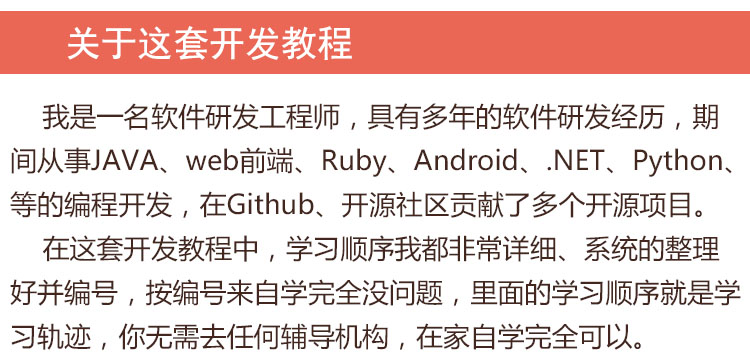

# 全套最新区块链Go语言视频教程
    
     
## 01Go语言视频教程--14G--[目录大纲](01Go语言.md)

> 网盘地址: 链接：https://pan.baidu.com/s/1ZXcMmkItm-KnKvrWL5DcIA 提取码：vxiz

## 02区块链技术之GoWeb视频教程--3.1G--[目录大纲](02区块链技术之GoWeb.md)

> 网盘地址: 链接：https://pan.baidu.com/s/1Q2UNU0ko\_-xIuyJB9rHlrQ 提取码：1oyb

## 03区块链以太坊理论视频教程--21G--[目录大纲](03区块链以太坊理论.md)

> 网盘地址: 链接：https://pan.baidu.com/s/1Lf9QB2dl2Zk4FeWOvaup\_A 提取码：ug7u

## 04区块链投票系统视频教程--4.6G--[目录大纲](04区块链投票系统.md)

> 网盘地址: 链接：https://pan.baidu.com/s/10f26Ev\_PA3X\_grQmasd1ww 提取码：6uer

## 05区块链拍卖系统视频教程--12G--[目录大纲](05区块链拍卖系统.md)

> 网盘地址: 链接：https://pan.baidu.com/s/1YnMrm1qprZtUla2V10Ojvg 提取码：lqnt

